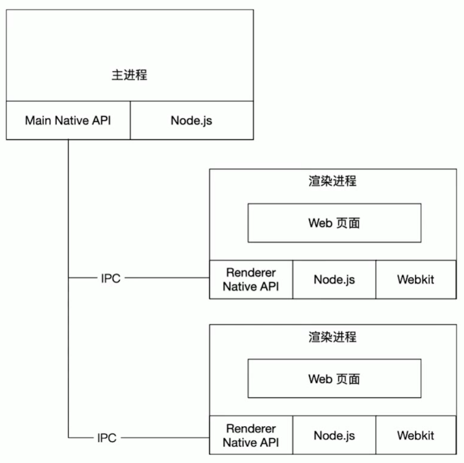

# electron-remote-control

## Notes

### Chromium 架构图


### Electron 架构图



- 构建个正儿八经的 electron 还有点麻烦
- 千万不能按 web 思想构建，一定要按 Electron 的框架模型来建，要不然就废了

- 启动脚本
  - `concurrently` 的若干命令间不需要加 `&&`
  - `wait-on` 等待启动

> 有点意思

```json
"scripts": {
  "start": "concurrently \"npm run start:render\" \"wait-on http://localhost:3000 && npm run start:main\" ",
  "start:main": "electron .",
  "start:render": "cd app/renderer/src/main && npm start"
},
```
